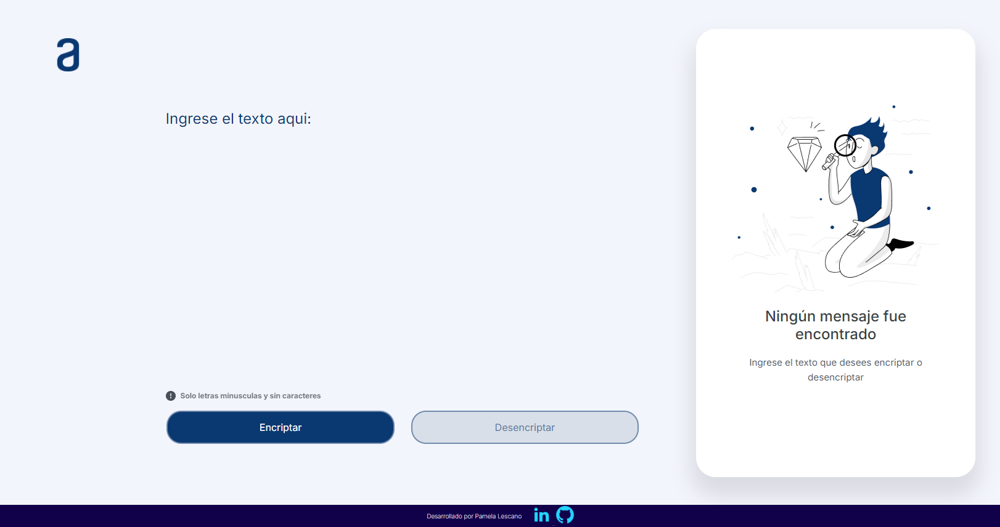
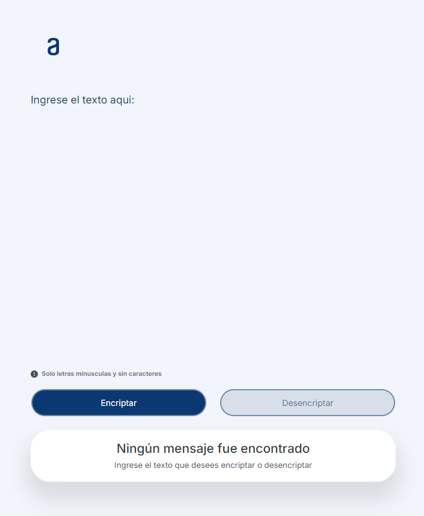
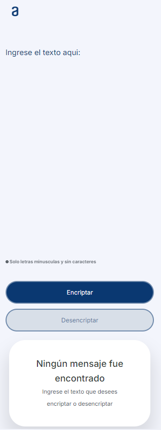

<h1 align="center">
<em>
¡Hola, bienvenido a mi proyecto Encripador! </em>
</h1>

# :name_badge: **Encriptador de Texto**

Este proyecto te permite encriptar y desencriptar mensajes utilizando un sencillo pero eficaz sistema de sustitución de caracteres. :closed_lock_with_key:

## :cop: **Descripción del Proyecto**

Este encriptador de texto está diseñado para transformar mensajes utilizando un conjunto de reglas específicas.

Es una herramienta útil para proteger información sensible o simplemente para divertirse creando mensajes secretos. 

La interfaz es intuitiva y fácil de usar, lo que lo hace ideal tanto para principiantes como para usuarios avanzados.

## :wrench: **Funcionalidades**

- `Encriptación`: Convierte tu texto en un mensaje codificado que solo otros usuarios de esta herramienta podrán leer.
- `Desencriptación`: Recupera el mensaje original desde un texto encriptado.
- `Copiar al portapapeles`: Una vez encriptado o desencriptado, puedes copiar el resultado directamente para usarlo en otros lugares.
- `Validación de texto*`: Asegúrate de ingresar solo letras minúsculas y espacios.

## :computer: **Cómo Usarlo**

1. `Ingresa el texto`: Escribe o pega el texto que deseas encriptar en el campo designado.
2. `Elige la acción`: Haz clic en "Encriptar" para convertir el texto o en "Desencriptar" para revertirlo.
3. `Copia el resultado`: Usa el botón de copiar para guardar el mensaje resultante en tu portapapeles.

## **Ejemplo de uso**

:heavy_check_mark: `Entrada`: hola mundo

:heavy_check_mark: `Encriptado`: hoberlai mufatndober

:heavy_check_mark: `Desencriptado`: hola mundo

## **Herramientas utilizadas**

* HTML

* CSS

* Flex-box

## **Responsivo:**
`vista en Tablet`:

`vista en Celular`:

## Hecho por:

:rabbit: 
### Pamela Lescano
:rabbit: 

### Redes Sociales:

Linkedin: www.linkedin.com/in/pamela-lescano-vila

### Agradecimiento

